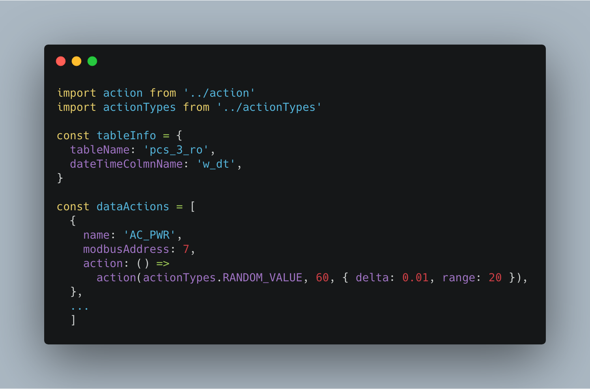

# NODEJS-SolRec5


## Feature
- Data Generate 
  - Data Models (1 Table : 1 Model)
  - Insert DB
  - Modbus Server 

## Requirement
- [Node.js ^v10.x.x](https://nodejs.org/ko/)
- [MySqlv v8.x.x](https://www.mysql.com) or [MariaDB](https://mariadb.org/)


## Init

```
npm install
```

## Run 

```
npm start
```

### Data model? 

#### Default model


#### Based on time model


#### Callback function model


